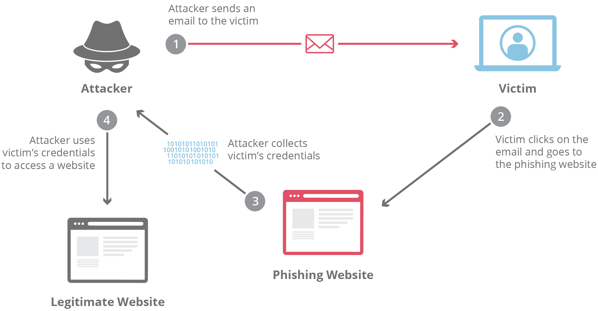

# Phishing Detection System

## Architecture du Système

```
┌─────────────────────────────────────────────────────────────────┐
│                    PHISHING DETECTION PIPELINE                  │
└─────────────────────────────────────────────────────────────────┘

                           INPUT
                              │
                              ▼
                    ┌──────────────────┐
                    │   RAW FEATURES   │
                    │    EXTRACTION    │
                    └──────────────────┘
                              │
        ┌─────────────────────┼─────────────────────┐
        │                     │                     │
        ▼                     ▼                     ▼
    ┌────────┐           ┌────────┐           ┌────────┐
    │  URL   │           │  DNS   │           │ SSL/TLS│
    │FEATURES│           │FEATURES│           │FEATURES│
    └────────┘           └────────┘           └────────┘
        │                     │                     │
        └─────────────────────┼─────────────────────┘
                              │
                              ▼
                 ┌────────────────────────┐
                 │  STATISTICAL ANALYSIS  │
                 │  (Chi², Mann-Whitney)  │
                 └────────────────────────┘
                              │
                              ▼
                 ┌────────────────────────┐
                 │ FEATURE SELECTION      │
                 │ (Forward Selection)    │
                 └────────────────────────┘
                              │
                              ▼
                 ┌────────────────────────┐
                 │  MODEL TRAINING        │
                 │ (LightGBM/XGBoost)     │
                 └────────────────────────┘
                              │
                              ▼
                 ┌────────────────────────┐
                 │  PREDICTION & RESULTS  │
                 │ (ROC, Confusion Matrix)│
                 └────────────────────────┘

```

---

## 📋 Vue d'ensemble

Ce projet développe un **système de détection automatisé de sites de phishing** utilisant le machine learning. L'approche combine l'**extraction de features brutes**, l'**analyse statistique rigoureuse**, et la **sélection automatique de features** pour construire un modèle prédictif robuste et interprétable.

### Objectifs Principaux
- Classifier les URLs comme **légitimes (bénignes)** ou **malveillantes (phishing)**
- Justifier chaque décision par une **analyse statistique des données**
- Créer des **features interprétables** basées sur des insights métier
- Atteindre une **performance optimale** avec un ensemble minimal de features

---

## 🔍 Méthodologie

### 1️⃣ Extraction des Features BRUTES
Le projet extrait des features **sans catégorisation a priori** :

**Features URL**
- Longueur URL, domaine, FQDN
- Entropie du domaine (caractères aléatoires)
- Rapport consonnes/voyelles
- Présence d'IP, tirets, symboles '@'
- Profondeur de sous-domaines

**Features DNS**
- Compteurs : NS, MX, TXT, SOA, A, AAAA
- Présence de DMARC
- Code pays (GeoIP)
- Code ASN

**Features SSL/TLS**
- Validité du certificat
- Émetteur du certificat (brut)
- Durée de validité
- Wildcard (*.domaine.com)

**Features Contenu**
- Nombre de ressources externes
- Nombre de domaines uniques
- Statut HTTP
- Redirections
- Nombre de cookies
- Technologies détectées

**Features Historique**
- Présence dans Wayback Machine
- Âge du domaine
- Années actives d'historique

### 2️⃣ Analyse Statistique des Données
Plutôt que d'imposer des règles arbitraires, on **analyse le dataset** pour identifier ce qui distingue vraiment les phishings :

#### Test Chi-2 pour chaque catégorie
```
Hypothèse : La distribution d'une feature est-elle significativement 
différente entre domaines bénins et malveillants ?
→ p-value < 0.05 = significatif statistiquement
```

#### Identification des TLDs risqués
- Calcul du **ratio malveillant** = malveillants / total pour chaque TLD
- Comparaison au **baseline global** (baseline × 1.2 = seuil)
- Sélection : ratio_malicious > baseline × 1.2 ET p-value < 0.05

**Exemple concret** :
- Baseline global : 60% malveillants
- Seuil : 60% × 1.2 = 72%
- TLD ".tk" : 85% →  Sélectionné (haut risque)
- TLD ".com" : 62% →  Pas sélectionné (trop proche du normal)

#### Analyse des émetteurs SSL
- Identifie les émetteurs **à haut risque** (ratio > baseline × 1.2)
- Identifie les émetteurs **premium** (ratio < baseline × 0.5)
- Justifie chaque catégorisation par des statistiques

### 3️⃣ Feature Engineering Justifié par les Données

#### Catégories basées sur l'analyse statistique
```python
is_high_risk_tld      # TLDs significativement plus risqués
is_high_risk_ssl      # Émetteurs SSL non-fiables
is_premium_ssl        # Émetteurs SSL réputés
is_high_risk_country  # Pays avec taux de phishing élevé
ssl_is_short_validity # Certificats à courte durée
```

#### Scores composites

**DNS Trust Score** (0-17)
```
= clip(dns_ns_count, 0, 5) 
  + clip(dns_mx_count, 0, 5) 
  + clip(dns_txt_count, 0, 5) 
  + dmarc_exists × 2
```
- **Logique** : Domains légitimes = infrastructure DNS solide
- **Clip** : Évite que 100 serveurs NS noient le score
- **DMARC** : Double poids (important pour la sécurité email)

**Domain Maturity Score** (0-∞)
```
= log1p(domain_age_days) 
  + wayback_years_active × 0.5 
  + has_wayback_history × 3
```
- **Logique** : Les domaines anciens sont plus légitime
- **log1p** : Évite log(0) et compresse les valeurs extrêmes
- **Exemple** : 0 jours → 0, 365 jours → 5.9, 10000 jours → 9.2

**URL Suspicion Score** (0-∞)
```
= domain_entropy 
  + domain_cv_ratio × 0.2 
  + subdomain_depth 
  + is_high_risk_tld × 2 
  + has_ip_in_url × 5 
  + url_at_count × 3
```
- **Logique** : Détecte les URLs suspectes
- **IP dans URL** : Poids fort (très phishing)
- **Symbole @** : Poids fort (obfuscation classique)

**SSL Trust Score** (0-5)
```
= ssl_is_valid 
  + is_premium_ssl × 2 
  + (1 - is_high_risk_ssl) 
  + ssl_is_wildcard 
  + (1 - ssl_is_short_validity)
```
- **Logique** : Mesure la confiance du certificat SSL
- **Premium SSL** : Double poids (LetsEncrypt, DigiCert = fiable)

**Legitimacy Score** (combiné)
```
= dns_trust_score 
  + ssl_trust_score 
  + domain_maturity_score 
  - url_suspicion_score
```

#### Interactions (XOR features)
```python
entropy_x_no_history     # Domaine aléatoire SANS historique = très suspect
risky_tld_x_risky_ssl    # TLD risqué + SSL louche = cumul de risques
short_ssl_x_no_history   # Certificat court + pas d'historique = phishing
```

### 4️⃣ Forward Selection (Sélection Automatique)
Plutôt que de garder toutes les features, on sélectionne **itérativement** :

**Algorithme**
1. Commencer avec 0 features
2. Pour chaque feature restante : tester en validation croisée (5-fold)
3. Ajouter la feature qui améliore le score ROC-AUC le plus
4. Arrêter si amélioration < 0.0005 pendant 3 itérations
5. Résultat : ~15-20 features pertinentes sur 60+

**Avantages**
- Élimine la redondance
- Réduit l'overfitting
- Améliore la généralisation
- Facilite l'interprétation

### 5️⃣ Modélisation et Évaluation

**Modèles testés**
- Logistic Regression (baseline simple)
- Random Forest (robuste aux outliers)
- Gradient Boosting (flexible)
- LightGBM (rapide et efficace)
- XGBoost (état de l'art)

**Métriques**
- **ROC-AUC** : Mesure la discrimination entre classes
- **Accuracy** : % de prédictions correctes
- **Precision** : % de phishings détectés sont vraiment des phishings
- **Recall** : % des vrais phishings détectés
- **F1-Score** : Harmonie precision-recall
- **PR-AUC** : Robuste au déséquilibre des classes

---

## 📊 Analyse Statistique Clé

### Approche Médiane pour SSL Validity
```python
benign_median = 365 jours    # Certificats d'un an typiques
malicious_median = 180 jours # Certificats temporaires
seuil = (365 + 180) / 2 = 272.5 jours
```

**Pourquoi la médiane ?**
- Insensible aux outliers (certificats de 10 ans)
- Plus représentative que la moyenne
- Médiane de deux classes = point d'équilibre optimal

### Filtrage par Multiplicateurs
```
TLD à haut risque     : ratio_malicious > baseline × 1.2  (20% au-dessus)
SSL Premium           : ratio_malicious < baseline × 0.5  (50% en-dessous)
```

**Justification**
- Sans multiplicateur : trop de faux positifs
- × 1.2 : Capture les vraies anomalies
- × 0.5 : Identifie les certificats premium (LetsEncrypt, etc.)

---

## 🗂️ Structure du Projet

```
Project_Phishing/
├── phishing_detection.ipynb   # Notebook principal
├── README.md                  # Documentation
```

### Format JSON des données
```json
{
  "url": "https://example.com",
  "metadata": {
    "rd": "example",
    "fqdn": "example.com",
    "tld": "com"
  },
  "host_info": {
    "ns": {"answers": [...]},
    "mx": {"answers": [...]},
    "txt": {"answers": [...]},
    "ssl": {
      "is_valid_cert": true,
      "issuer": "Let's Encrypt",
      "valid_from": "2024-01-01",
      "valid_until": "2025-01-01"
    },
    "maxmind": [{"answers": {"cc_code": "US"}}]
  },
  "content_info": {
    "status_code": 200,
    "title": "Example Domain",
    "har": [...]
  },
  "additional": {
    "rd": {
      "wayback_info": {
        "first_ts": "20150101",
        "years": {}
      }
    }
  }
}
```

---

##  Utilisation

### 1. Installation des dépendances
```bash
pip install pandas numpy scikit-learn matplotlib seaborn \
            tqdm lightgbm xgboost scipy
```

### 2. Préparation des données
```python
# Placer les fichiers JSON dans :
# - Benign_Data_BDA/    (domaines légitimes)
# - Final_Phishing_Dataset/  (domaines malveillants)
```

### 3. Exécution du pipeline
```python
# Extraction brute
extractor = RawFeatureExtractor()
df = load_and_extract(all_files, label, extractor)

# Analyse statistique
tld_analysis = analyze_categorical_feature(df, 'tld_raw')
ssl_analysis = analyze_categorical_feature(df, 'ssl_issuer_raw')

# Feature engineering
df_engineered = create_data_driven_features(df, tld_analysis, ssl_analysis)

# Forward selection
forward_selector.fit(X_train, y_train)

# Modélisation
best_model.fit(X_train_selected, y_train)
```

### 4. Prédiction sur nouveau domaine
```python
# Extraire features
new_features = extractor.extract_all_features(data)
new_features_engineered = create_data_driven_features(pd.DataFrame([new_features]))
X_new_selected = new_features_engineered[selected_features]

# Prédire
prediction = best_model.predict(X_new_selected)
probability = best_model.predict_proba(X_new_selected)[0, 1]

print(f"Phishing Probability: {probability:.2%}")
```

---

## 📈 Résultats Attendus

**Performance typique** (validation croisée 5-fold) :
- ROC-AUC : 0.95+
- Accuracy : 92-95%
- Precision : 90-94%
- Recall : 90-95%
- F1-Score : 0.92+

**Features les plus importants** (selon Random Forest) :
1. Domain maturity score
2. SSL trust score
3. Domain entropy
4. URL suspicion score
5. Has wayback history
6. DNS trust score
7. TLD risk index
8. SSL validity days

---

## 🔑 Points Clés de la Conception

### Approche Basée sur les Données
- **Pas d'hypothèses arbitraires** : Tout est justifié par l'analyse statistique
- **Chi-2 test** : Validation formelle de la significativité
- **Multiplicateurs adaptatifs** : Thresholds basés sur le baseline

### Robustesse
- **Clip() sur les features** : Évite la domination des outliers
- **log1p() pour les âges** : Transformation stable
- **Médiane au lieu de moyenne** : Résistant aux valeurs extrêmes
- **Forward selection** : Élimine la redondance

### Interprétabilité
- **Features composites explicites** : dns_trust_score, legitimacy_score
- **Scores métier clairs** : Ce qu'ils mesurent est compréhensible
- **Interactions logiques** : entropy_x_no_history a un sens

### Généralisation
- **Validation croisée 5-fold** : Validation robuste
- **Stratification** : Équilibre train/test
- **StandardScaler** : Normalisation des features

---

## 📚 Concepts Expliqués

### Pourquoi `clip(0, 5)` ?
Sans limites, un domaine avec 100 serveurs NS dominerait le score. Avec `clip(0, 5)`, on crée une saturation à 5, évitant la distorsion.

### Pourquoi `log1p()` ?
- `log(0)` → erreur
- `log1p(0)` → 0
- Compresse les grandes valeurs sans perdre les petites différences

### Pourquoi `baseline × 1.2` ?
Point de sévérité objectif : sélectionner **seulement** ce qui est 20% au-dessus du normal, évitant les borderline.

### Pourquoi Forward Selection ?
Avec 60+ features, 90% seraient redondantes. Forward selection garde **seulement les 15-20 vraiment utiles**, améliorant la généralisation.

---

## 🔗 Références

- **Chi-2 Test** : Test d'indépendance statistique ([Wikipedia](https://en.wikipedia.org/wiki/Chi-squared_test))
- **Forward Feature Selection** : Technique de sélection itérative ([Scikit-Learn](https://scikit-learn.org/))
- **ROC-AUC** : Métrique de performance ([Understanding ROC Curves](https://en.wikipedia.org/wiki/Receiver_operating_characteristic))
- **Phishing Detection Literature** : Domain-based features are proven discriminative
